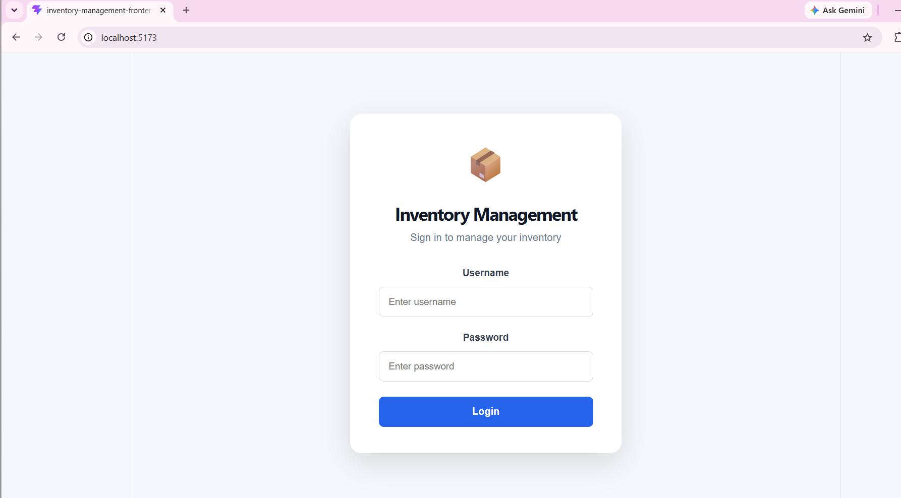
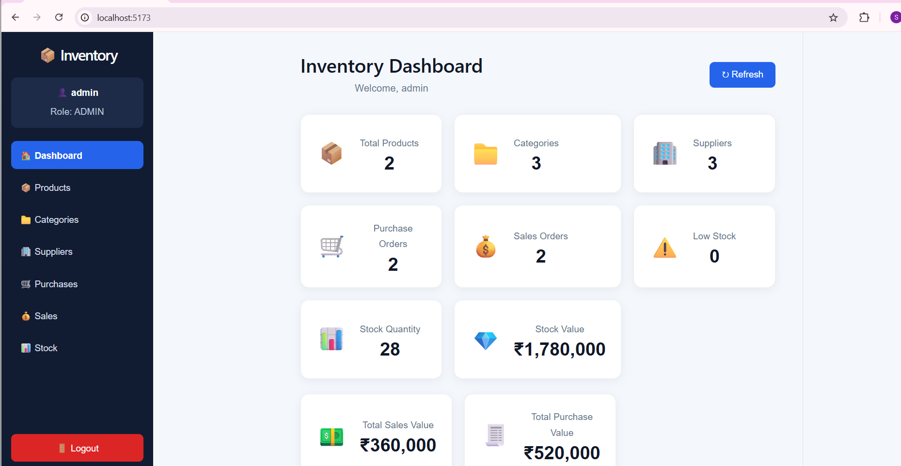
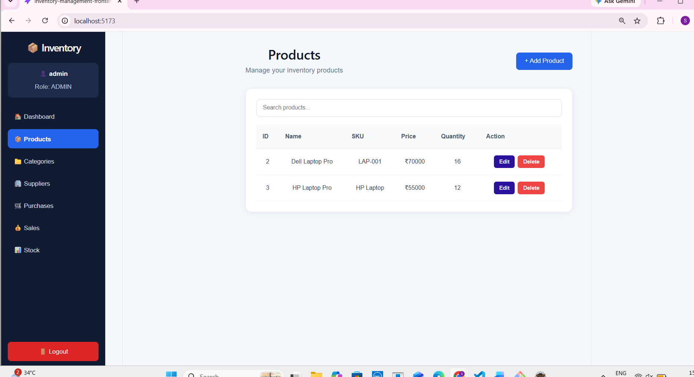
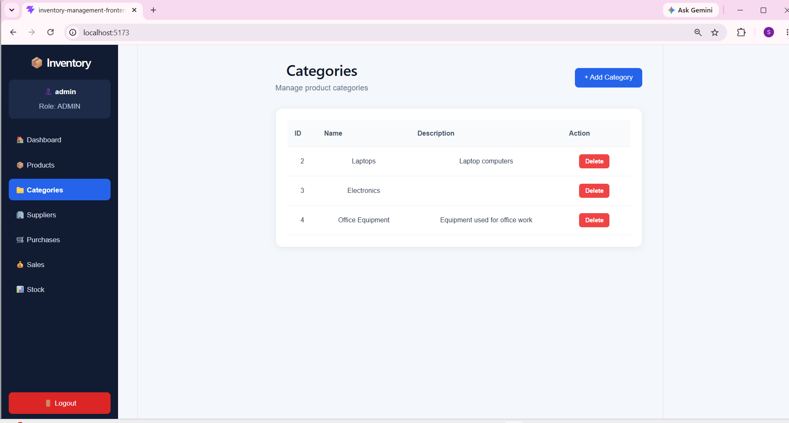
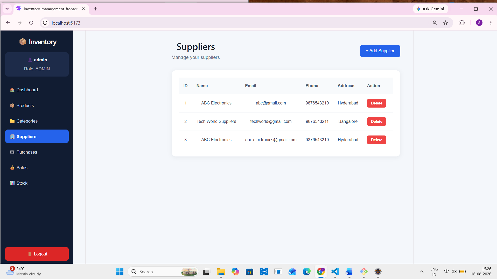
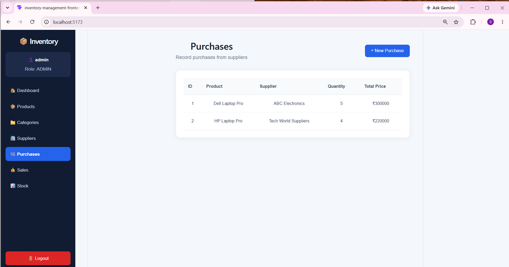
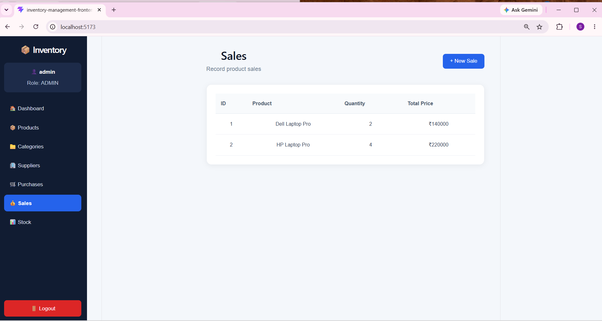
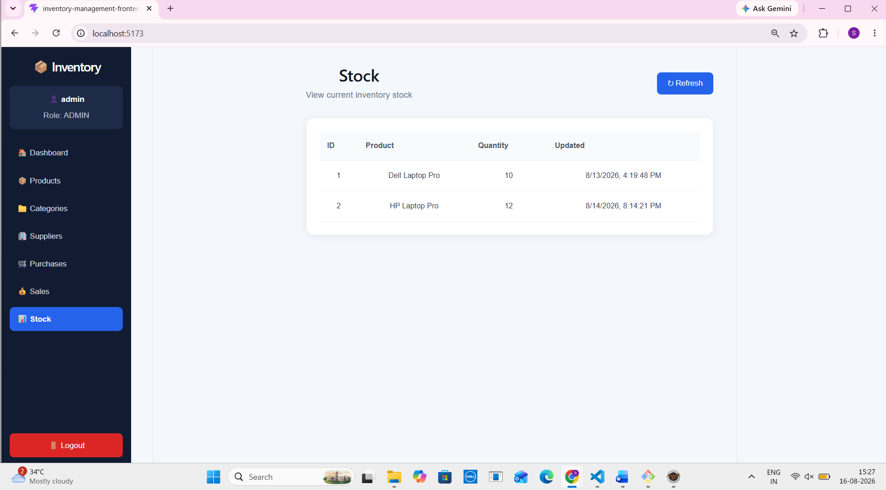

\# Inventory Management System


\## Project Overview


The Inventory Management System is a full-stack web application developed to manage products, categories, suppliers, purchases, sales, and inventory stock.


The system provides a centralized dashboard for monitoring inventory information and allows authorized users to manage inventory operations through a user-friendly web interface.


\## Features


\- User login and authentication

\- Admin role-based access

\- Inventory dashboard

\- Product management

\- Category management

\- Supplier management

\- Purchase management

\- Sales management

\- Stock management

\- Product search

\- Add, edit, and delete products

\- Add and manage categories

\- Manage suppliers

\- Record purchases

\- Record sales

\- View current stock quantity

\- View inventory statistics

\- Low-stock product monitoring

\- Stock value calculation

\- Purchase value tracking

\- Sales value tracking

\- Responsive web interface


\## User Roles


\### Admin


The Admin user can access and manage the inventory system.


Admin features include:


\- View dashboard

\- Manage products

\- Manage categories

\- Manage suppliers

\- Record purchases

\- Record sales

\- View current stock

\- View inventory statistics

\- Add products

\- Edit products

\- Delete products


\## Technologies Used


\### Frontend


\- React

\- Vite

\- JavaScript

\- HTML

\- CSS


\### Backend


\- Java

\- Spring Boot

\- Maven

\- REST APIs


\### Database


The application uses a backend database to store and manage:


\- User information

\- Products

\- Categories

\- Suppliers

\- Purchases

\- Sales

\- Stock information


\## Project Structure


```text

inventory-management/

│

├── frontend/

│   ├── public/

│   ├── src/

│   ├── package.json

│   ├── package-lock.json

│   └── vite.config.js

│

├── src/

│   └── Backend source code

│

├──inventory_pro_outputs /

│   ├── login.png

│   ├── dashboard.png

│   ├── products.png

│   ├── categories.png

│   ├── suppliers.png

│   ├── purchases.png

│   ├── sales.png

│   └── stock.png

│

├── pom.xml

├── README.md

└── .gitignore


\## Application Modules


\### Login


The login page allows users to enter their username and password to access the Inventory Management System.


\### Dashboard


The Inventory Dashboard provides an overview of the inventory system.


It displays:


\- Total Products

\- Categories

\- Suppliers

\- Purchase Orders

\- Sales Orders

\- Low Stock

\- Stock Quantity

\- Stock Value

\- Total Sales Value

\- Total Purchase Value


\### Products


The Products module allows the administrator to manage inventory products.


Features include:


\- View products

\- Search products

\- Add products

\- Edit products

\- Delete products

\- View product price and quantity


\### Categories


The Categories module allows the administrator to organize products into different categories.


Features include:


\- View categories

\- Add categories

\- Delete categories

\- View category descriptions


\### Suppliers


The Suppliers module allows the administrator to manage supplier information.


Supplier information includes:


\- Supplier name

\- Email

\- Phone

\- Address

\- Add supplier

\- Delete supplier


\### Purchases


The Purchases module is used to record products purchased from suppliers.


Purchase information includes:


\- Purchase ID

\- Product

\- Supplier

\- Quantity

\- Total Price


\### Sales


The Sales module is used to record product sales.


Sales information includes:


\- Sale ID

\- Product

\- Quantity

\- Total Price


\### Stock


The Stock module displays the current inventory quantity for each product.


Stock information includes:


\- Stock ID

\- Product

\- Quantity

\- Last Updated


\## How to Run the Project


\### Prerequisites


Make sure the following are installed:


\- Java

\- Maven

\- Node.js

\- npm

\- A web browser

\- An IDE such as IntelliJ IDEA, Eclipse, or Spring Tool Suite


\### Run the Backend


Open the main `inventory-management` project in your IDE.


Make sure the database configuration is properly configured.


Run the Spring Boot backend application.


The backend provides the REST APIs used by the frontend.


\### Run the Frontend


Open a terminal inside the `frontend` folder:


```bash

cd frontend

```


Install the required dependencies:


```bash

npm install

```


Start the frontend:


```bash

npm run dev

```


The frontend will normally be available at:


```text

http://localhost:5173

```


Open the address in a web browser.


\### Login


Enter the available username and password.


After successful login, the user is redirected to the Inventory Dashboard.


\## Application Workflow


```text

Login

 ↓

Dashboard

 ↓

Products

 ↓

Categories

 ↓

Suppliers

 ↓

Purchases

 ↓

Sales

 ↓

Stock

```

## Results / Output

The application successfully provides the following results:

### Login

The login page allows authorized users to sign in to the Inventory Management System.



### Admin Dashboard

The dashboard displays inventory statistics including total products, categories, suppliers, purchases, sales, stock quantity, stock value, and low-stock information.



### Product Management

The Products page allows the administrator to view, search, add, edit, and delete products.



### Category Management

The Categories page allows the administrator to manage product categories.



### Supplier Management

The Suppliers page displays supplier information and allows the administrator to manage suppliers.



### Purchase Management

The Purchases page allows the administrator to record and view purchases from suppliers.



### Sales Management

The Sales page allows the administrator to record and view product sales.



### Stock Management

The Stock page displays the current inventory stock and available quantity for each product.




\## Future Enhancements


\- Employee-specific permissions

\- Additional user roles

\- Advanced inventory reports

\- Export inventory reports

\- Email notifications

\- Low-stock alerts

\- Improved search and filtering

\- Additional analytics

\- Inventory report generation


\## Author


\*\*Shafiya24\*\*


\## Project Status


The Inventory Management System is a working full-stack web application with authentication, inventory management, product management, category management, supplier management, purchase management, sales management, and stock tracking.

